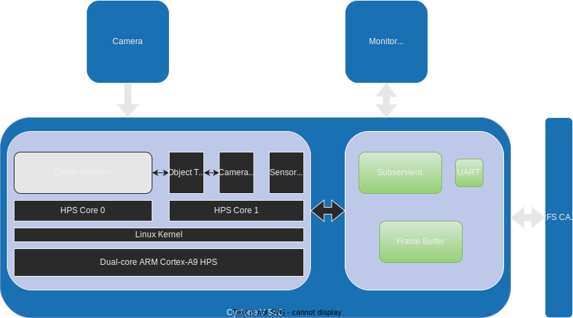

# FQ CONTROL CENTER

  

FQ-Control-Center is a utility software that combines ARM and FPGA controls together. It provides a simple GUI interface for use and highly customizable config files for development.

## Table of Contents
- [Overview](#overview)
    - [Camera Unit](#camera-unit)
    - [Sensor Aggregator Unit](#sensor-aggregator-unit)
    - [Webserver Unit](#webserver-unit)
- [Development](#suggested-tweaks)
- [Credits](#credits)

# **Overview**
