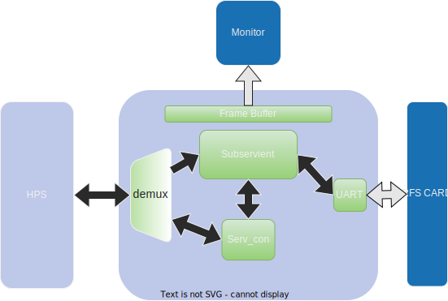

# FQ CONTROL CENTER

<p align="center">
  
</p>


FQ-Control-Center is a utility software that combines ARM and FPGA controls together. It provides a simple GUI and touchscreen interface for use and highly customizable config files for development.

This is the software part of the FQ-Control-Center that runs on the HPS.

## Table of Contents
- [HPS Software](#hps-software)
    - [Camera Unit](#camera-unit)
    - [Sensor Aggregator Unit](#sensor-aggregator-unit)
    - [Webserver Unit](#webserver-unit)
    - [Development](#suggested-tweaks)
        - [How to Deploy](#how-to-deploy)
        - [Software Development FAQ](#software-development-faq)
- [FPGA](#fpga)
    - [System Overview](#system-overview)
        - [Memory Map from HPS side](##memory-map-from-hps-side)
        - [Memory Map from Subservient side](#memory-map-from-subservient-side)
        - [Testbench](#testbench)
        - [FPGA Development FAQ](#fpga-development-faq)
    - [Software](#software)
- [Credits](#credits)

# **HPS Software**

FQ-Control-Center HPS software consists of 3 main parts:
* Camera Unit
* Sensor Aggregation Unit
    - Can be disabled to be compatible with Rasbery PI or Desktop Linux.
* Webserver Unit

## **Camera Unit**
Camera unit detects people by using deep neural networks and tracks them. It records the statistics of human traffic.

Object detection part of the software use Mobilenet Single Shot Multibox detector. MobileNet SSDs are small and have a low-latency. In this project I have chosen ssd_mobilenet_v1_0.75_depth_300x300_coco14_sync_2018_07_03 model. It has a decent mAP and more importantly it is fast.

Tracker part comes from OpenCV contrib tracking library. After some trial and error:
- TrackerMIL -> Slow and inaccurate. A lot of false positives.
- TrackerMOSSE -> Really fast. But, it takes time to lock on to a target.
- TrackerKCF -> Kinda slow but accurate.
- TrackerBoosting -> Buggy and slow.
- TrackerTLD -> Like KCF but a bit buggy?
- TrackerGOTURN -> Deep learning based tracker. Buggy as hell.
- TrackerMedianFlow -> Fastish but there are some false positives.
- TrackerCSRT -> Accurate but slow.    

I have decided to go with MOSSE algorithm.

### **Architecture**
Object detection and tracking is a sequential operation by nature. First it has to be continious in time. Webcam thread acquires frames. Object detection thread detects people from frames. Tracker thread tracks the detected people. One part of the operation can't be started without the previous one is finished. So, the simplest algorithm for object tracking is:
```
forever:
    read frame
    detect objects every couple of frames
    track objects
    display
```
Assuming one turn with the object detection takes less than the frame priod this is indeed a viable solution. Unfortunately for DE10-Nano HPS one turn takes 1.2 seconds that is 24 times longer than 20FPS video period. There are two viable solutions to speed up this process: FPGA OpenCL object detection accelerator or a multicore algorithm.

The first option is the best choice from performance perspective. We are guaranteed to solve FPS issue. But, It is the most challenging and time consuming choice. Porting a state of art object detection algorithm to OpenCL and debugging it sounds like a nightmare. And as someone who knows about deep neural networks for the couple months it adds another layer of doubt.

The second option is the easiest one. We can directy use pretrained and tested Deep Neural Network. Also, one of the threads can be easily replaced by an FPGA accelerator down the line and combine with the first method. But, there is a chance that HPS alone will not be enough to solve FPS problem.

I obviously went for the second option. Object detection takes 1 seconds for a single ARM core without tracking and webcam. If I can offload tracking and detection to the second core, we can achieve a real-time tracking and a detection update every second. Sounds plausable.

**New algorithm:**

There are three threads. Object detection thread runs non-stop and detects objects. During this heavy and long computation Webcam thread stores the frames. As soon as object detection ends, recorded frames and detected object results are sent to the Tracker thread and the most recent frame is fed into the detector.
<p align="center">
  
</p>


The new algorithm intorduces couple of new challenges; Consumer-Producer problem and data duplication problem:

- Webcam thread produces unknown number of frames between each object detection. Size of frame packet depends on object detection speed. Longer the detection takes the more frames are produced. 
- Object detection thread must read the most recent frame.
- All threads has to synchronize at the end of object detection.
- Threads must not eat away CPU resources when they are waiting for synchronization.
- There can't be a large number of duplicate frames.

**Solution:**    
<p align="center">
  
</p>

Conditional variables solves the waiting problem. They also mitigate the CPU usage problem when idling. Pointers solve the duplication problem. Preallocate three frame packets and swap the pointers in each thread starting from tracker to webcam. But, they introduce another problem. Who will swap them?    

Swapping requires coordination among all threads. Swaping while one of them is operating on it will generate a core dump. So, swapper thread either has to be dedicated to its job and wait for three different conditional variables from each thread. Or it has to be the fastest one among tracker, detector and webcam. I choose the second option since there are 2 physical cores on DE10-Nano and adding more threads will not translate to more performance, at least not directly. So, the fastest thread and the one that will swap frames is webcam thread. In worst case tracker and object detector will be ready just before webcam starts to read a frame. In this case wasted compute time will be equal to the frame time.

Application code is cluttered by OpenCV and other libraries. So, the reference design of the barebone threading architecture can be found [here](/doc/thread_architecture/thread_architecture.pro). It may not be up to date with the latest software version.

## **Sensor Aggregator Unit**
Sensor Aggregator unit is responsible of the initialization of the Subservient module and FPGA bridge. After the setup it periodically reads from the memory mapped shared memory. This section can be disabled to make FQ-Control-Center run on different platforms without an FPGA.
<p align="center">
  
</p>

## **Webserver Unit**
[Under Construction]
Webserver unit will send data with Asure Cloud.
[Under Construction]

# **Development**
Requirements:
- glibc == 2.27
- OpenCV == 4.2.0
- 5.12.12 >= QT >= 5.5.0
- QT Creator == 5.0.2

## Setup development enviroment
- Install ARM cross compiler:
    - ```sudo apt-get install gcc-arm-linux-gnueabihf g++-arm-linux-gnueabihf```
- Extract precompiled QT libraries (in this case to opt):
    - ```sudo tar zxvf qt5.5.1_for_intel_soc.tar.gz -C /opt```
- Add compilers and QT as a kit to QT creator
- Set working directory of project to code directory
- If you are compiling for x86 CPU, change OpenCV library path accordingly

## How to Deploy
- Copy OpenCV shared libraries into a folder. In this case its the plugins folder. And export it.
    - ```export LD_LIBRARY_PATH=/root/fq_control_center/plugins``` 
- Copy config and DNN directories to the same folder as executable.
- Select display.
    - ```export DISPLAY=:0```
- Run the app.
    - ```./fq_control_center```

## Software Development FAQ
- **glibc?**    
    DE10-Nano default image is Ubuntu 18.04 which is shipped with glibc 2.27. This prevents any program that is compiled higher glibc version from running. You can upgrade to 20.04 which also upgrades the glibc version.

- **Can I use a new version of OpenCV?**    
    No, Tracker contrib modules are deprecated. If you do you have to edit the code to accomodate legacy libraries.

- **Why did you choose OpenCV plot library rather than QTCharts?**    
    QT version of precompiled libraries from Terasic is 5.5.1 and QTCharts introduced in QT 5.7. And no, I didn't bother to rebuild QT.

- **QT Creator? Why can't I use CLI qmake?**    
    You can but I haven't tried so I don't suggest it. Also, new versions of QT were a bit wonky.

- **Why did you choose DNN for object detection? Why not HOG?**    
    For some reason both accuracy and performance of HOG was worse than DNN.

- **Why did not you use Tensorflow or Pytorch for DNN inference. Why OpenCV?**    
    I haven't tried pytorch. Tensorflow was slower than OpenCV.

# FPGA
## System Overview

<p align="center">
  
</p>

FPGA portion of the FQ-Control-Center use Terasic DE10-Nano Frame Buffer Demonstration project as a base template. Only extra addition is subservient module. I have added a UART peripheral and turned wishbone bus debug interface to avalon interface and also added it as a QSYS ip module.

Subservient software is updated through debug interface which is connected to the HPS via avalon bus.
### **Memory Map from HPS side**
Subservient is connected to lightweight bridge. Hence, you should add lwbridge offset to the values given below to obtain the absolute addresses.
| Peripheral| Base Address| Read/Write |
| --- | ---     | ---|
| Subservient Base Address | 0x8000|rw|
| Debug Mode Register| 0x8000-0x87ff| w |
| Debug Mode Register| 0x8000| w |
| Shared Memory| 0x8000-0x802f| r |

### **Memory Map from Subservient side**
Subservient peripherals and absolute addresses:

| Peripheral| Base Address| Read/Write |
| --- | ---     | ---|
| SRAM | 0x00000000-0x000007ff|rw|
| SHARED_MEM | 0x40000000|rw|
| TIMER | 0x80000000|rw|
| PRESCALAR | 0xC0000000|w|
| RX_DHBR | 0xC0000004|w|
| TX_BUSY | 0xC0000008|r|
| TX_SEND | 0xC000000C|w|
| TX_DATA | 0xC0000010|w|
| RX_READY | 0xC0000014|r|
| RX_DATA | 0xC0000018|r|

**Application notes and information:**    
Sample program for Subservient can be found [here.](fpga/sw/serv/project/entry_point.cpp)    
UART TX sends data upon write operation. TX_BUSY is high if UART TX is in the middle of the sending operation. Before sending any data you have to wait for it to be cleared. Writing when TX_BUSY is high is undefined.

RX_READY is set if there is a new data ready to read at RX_DATA. Upon read user has to write to RX_DHBR register to indicate data has been read. Otherwise RX_READY will not be cleared.

Setting debug mode does not kill the Subservient. As soon as debub mode is cleared it can continue its operations. But, it obviously will miss any new UART packages.

### **Testbench**

Testbench of the design is located in the bench folder. You can directly run it with either GTK Wave or Modelsim.
<p align="center">
  
</p>


### **FPGA Development FAQ**

- **[There](https://github.com/intel-iot-devkit/terasic-de10-nano-kit/tree/master/azure-de10nano-document/sensor-aggregation-reference-design-for-azure) is an exactly similar coprocessor design with NIOS II. Why did you use subservient?**    
    I was planning to use 10-20 different subservients with their own dedicated sensor reading and preprocessing routines. Which is not possible with NIOS II since it is huge. But, I run out of time.

- **Why don't you directly read obtained data from Subservient via debug interface?**    
    There is a read problem in the debug interface. wb_rdt signal is stuck at the some value that is referenced by Subservient right before debug enable is set. I am sure the reason is something trivial but I neither have time nor motivation to debug and solve it. Hence, as a dirty workaround I have added shared memory section and redirected read operations to there.

# Credits
