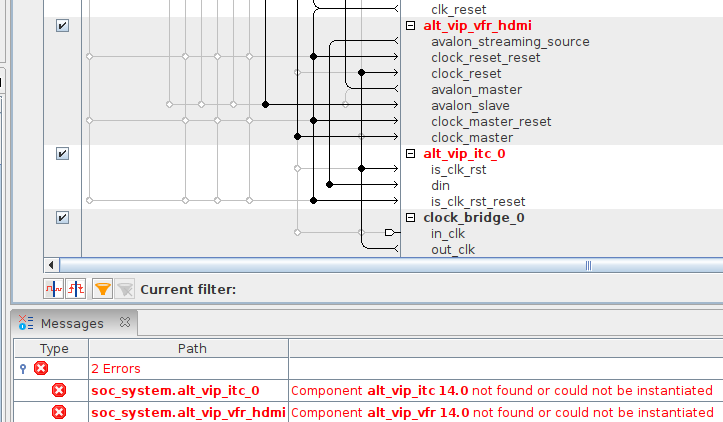

Quartus 21.1 can't find the frame buffer and clocked output ips. There are new components with similar name and purpose in Quartus 21.1 but for some reason there is no migration script to handle this situation.    

You have three options. The first one is to manually add and replace those components. The second one is to find those ip's online and place them into Quartus ip folder. Which I doubt will work due to license reasons. And the last is to install an older version of Quartus.    
* I decided to downgrade since old version of the Quartus follow my system theme on Ubuntu 20.04 and I don't need the new quartus features. I also couldn't find the tcl/v files of the missing ips so downgrade (Quartus 17.0) was the best option.
