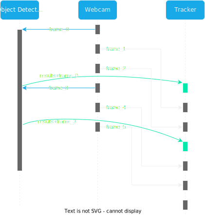
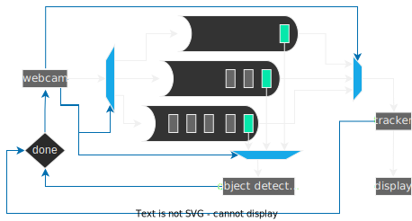

FQ-Control-Center is a utility software that combines ARM and FPGA controls together. It provides a simple GUI interface for use and highly customizable config files for development.

* Table of Contents
    * Overview
        * Camera Unit
        * Sensor Aggregation unit
        * Webserver Unit
    * Development

FQ-Control-Center consists of 3 main parts:
* Camera Unit
* Sensor Aggregation Unit
* Webserver Unit

# Camera Unit:
Camera unit detects people by using deep neural networks and tracks them. It records the statistics of human traffic.

## Software architecture:
Object detection and tracking is a sequential operation by nature. First it has to be continious in time. Webcam thread acquires frames. Object detection thread detects people from frames. Tracker thread tracks the detected people. One part of the operation can't be started without the previous one is finished. So, the simplest algorithm for object tracking is:
```
forever:
    read frame
    detect objects every couple of frames
    track objects
    display
```
Assuming one turn with the object detection takes less than the frame priod this is indeed a viable solution. Unfortunately for DE10-Nano HPS one turn takes 1.2 seconds that is 24 times longer than 20FPS video period. There are two viable solutions to speed up this process: FPGA OpenCL object detection accelerator or a multicore algorithm.

The first option is the best choice from performance perspective. We are guaranteed to solve FPS issue. But, It is the most challenging and time consuming choice. Porting a state of art object detection algorithm to OpenCL and debugging it sounds like a nightmare. And as someone who knows about deep neural networks for the couple months it adds another layer of doubt.

The second option is the easiest one. We can directy use pretrained and tested Deep Neural Network. Also, one of the threads can be easily replaced by an FPGA accelerator down the line and combine with the first method. But, there is a chance that HPS alone will not be enough to solve FPS problem.

I obviously went for the second option. Object detection takes 1 seconds for a single ARM core without tracking and webcam. If I can offload tracking and detection to the second core, we can achieve a real-time tracking and a detection update every second. Sounds plausable.

**New algorithm:**

There are three threads. Object detection thread runs non-stop and detects objects. During this heavy and long computation Webcam thread stores the frames. As soon as object detection ends, recorded frames and detected object results are sent to the Tracker thread and the most recent frame is fed into the detector.
<p align="center">
  
</p>


The new algorithm intorduces couple of new challenges; Consumer-Producer problem and data duplication problem:

- Webcam thread produces unknown number of frames between each object detection. Size of frame packet depends on object detection speed. Longer the detection takes the more frames are produced. 
- Object detection thread must read the most recent frame.
- All threads has to synchronize at the end of object detection.
- Threads must not eat away CPU resources when they are waiting for synchronization.
- There can't be a large number of duplicate frames.

**Solution:**    
<p align="center">
  
</p>
Conditional variables solves the waiting problem. They also mitigate the CPU usage problem when idling. Pointers solve the duplication problem. Preallocate three frame packets and swap the pointers in each thread starting from tracker to webcam. But, they introduce another problem. Who will swap them?    
Swapping requires coordination among all threads. Swaping while one of them is operating on it will generate a core dump. So, swapper thread either has to be dedicated to its job and wait for three different conditional variables from each thread. Or it has to be the fastest one among tracker, detector and webcam. I choose the second option since there are 2 physical cores on DE10-Nano and adding more threads will not translate to more performance, at least not directly. So, the fastest thread and the one that will swap frames is webcam thread. In worst case tracker and object detector will be ready just before webcam starts to read a frame. In this case wasted compute time will be equal to the frame time.

Application code is cluttered by OpenCV and other libraries. So, the reference design of the barebone threading architecture can be found [here](/doc/thread_architecture/thread_architecture.pro).

# Sensor Aggregator Unit [Under Construction]
Sensor Aggregator Unit communicates with the FPGA and acquires desired data.
# Webserver Unit [Under Construction]
Webserver unit communicates with Asure Cloud

# Development
Requirements:
- glibc == 2.27
- OpenCV == 4.2.0
- 5.12.12 >= QT >= 5.5.0
- QT Cretor == 5.0.2

- **glibc?**    
    Google it.
- **Can I use a new version of OpenCV?**    
    No, Tracker contrib modules are deprecated.
- **Why did you use OpenCV plot library rather than QTCharts?**    
    QT version of precompiled libraries from Terasic is 5.5.1 and QTCharts introduced in QT 5.7. And no, I didn't bother to rebuild QT.
- **QT Creator? Why can't I use CLI qmake?**    
    You can but I haven't tried so I don't suggest.
- **Why did you use DNN for object detection? Why not HOG?**    
    For some reason both accuracy and performance of HOG was worse than DNN.
- **Why not use Tensorflow or Pytorch for DNN inference. Why OpenCV?**    
    I haven't tried pytorch. Tensorflow was slower than OpenCV.
- **How did you decide on tracker algorithm and DNN model**    
    Performance >= all

## How to Deploy the app
- Copy OpenCV shared libraries into a folder. In this case its the plugins folder. And export it.
    - ```export LD_LIBRARY_PATH=/root/nn/plugins``` 
- Select display.
    - ```export DISPLAY=:0```
- Run the app.
    - ```./fq_control_center```

TrackerMIL -> slow and inaccurate. A lot of false positives
TrackerMOSSE -> really fast. But it takes time to lock on to a box
TrackerKCF -> kinda slow but accurate
TrackerBoosting -> buggy and slow
TrackerTLD -> like KCF but a bit buggy?
TrackerGOTURN -> Deep learning based tracker. Buggy as hell.
TrackerMedianFlow -> Fast but there are some false positives
TrackerCSRT -> Accurate but slow
